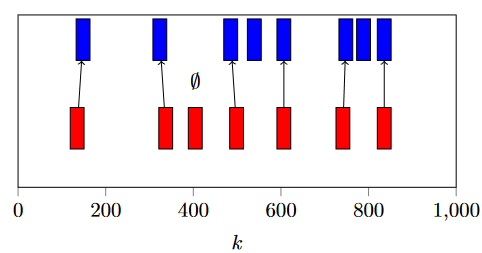

# SymbolicRegression4HA

This project implements the first steps for using symbolic regression in hybrid system identification.

The general flow of hybrid system identification has the following five steps:

This projects is composed of two algorithms which implement the steps *Trace Segmentation* and both *Segment Grouping* and *Mode Characterization*.

## Installation

We recommend to use a virtual environment for the installation of the project. The project is tested with Python 3.12.1.

### Creating a Virtual Environment

To create a virtual environment, run the following command in the project directory:

```bash
python -m venv venv
```

### Activating the Virtual Environment

To activate the virtual environment, run the following command in the project directory:

- Linux / WSL:
```bash
source venv/bin/activate
```
- Windows:
```bash
.\venv\Scripts\Activate
```

### Installing the Dependencies

To install the dependencies, run the following command in the project directory:

```bash
pip install -e .
```

### Running an Example

To run an example, run the following command in the project directory:

```bash
python src/sr4ha/main.py --config <path_to_config_file.yaml>
```

The configuration files for the existing examples are stored in the `config` directory.

## Project Structure

The project is structured as follows:
- the directory `src` contains the source code of the project separated into the core parts such as the symbolic regression algorithm and the hybrid system identification algorithms and the intermediate results, further there are stopping criteria for the algorithms, experiment scripts for the segmentation and grouping part and scripts for parameter studies with optuna for selected examples. Finally, the directory contains the main script for running the complete flow
- the directory `data` contains data sets for example systems stored with git lfs
- the directory `results` contains the results of the experiments for the examples
- the directory `config` contains the configuration files for the experiments
- the directory `sr-analysis` contains scripts for minor analyses
- the directory `tests` provides an (incomplete) set of unit tests for the project 

## Publication and Reference

The project is part of the publication "Dynamics-Based Identification of Hybrid Systems using Symbolic Regression":

```
@inproceedings{PSSTF2024,
  author          = {Swantje Plambeck and Maximilian Schmidt and Audine Subias and Louise Travé-Massuyès and Goerschwin Fey},
  booktitle       = {Software Engineering and Advanced Applications (SEAA)},
  title           = {Dynamics-Based Identification of Hybrid Systems using Symbolic Regression},
  year            = {2024 (in press)},
    url           = {https://www.tuhh.de/t3resources/es/data/publications/inPress/Learning_Hybrid_Systems_with_Symbolic_Regression-10.pdf}
}
```

## Getting Started

TBD

## Parameter Studies

The directory `src/sr4ha/parameter-studies` contains scripts for parameter studies with [optuna](https://optuna.readthedocs.io/en/stable/) for selected examples. The parameter studies are conducted for the following examples:
- *Converter*
- *Two Tank* (with and without feature substitution)

Both parts of the algorithm, i.e., the segmentation and the grouping part, are evaluated. The parameter studies are conducted for the following parameters:

Symbol | Occurrence | Description |
--- | --- | --- |
$l_{init}$ | Segmentation | initial window size when learning an expression
$l_{step}$ | Segmentation | step-width for extending the window
$n_{init}$ | Segmentation | number of iterations of SR when learning an expression
$n_{update}$ | Segmentation | number of iterations of SR for updating the expression on an extension
$\tau$ | Segmentation | threshold for the segmentation criterion
$\varphi$ | Grouping | relaxation parameter for the grouping criterion
$n_g$ | Grouping | number of iterations of SR when learning on grouped data
$\rho_s, \rho_g$ |General | SR Parsimony coefficient (length-accuracy trade-off) for segmentation and grouping
$p_s, p_g$ | General | SR Population size for segmentation and grouping

For the parameter optimization with optuna, we define two objective functions for the segmentation and grouping part:

$$\Omega_{seg}(m,T_{gt}, T_{f}) = \frac{1}{|T_{f}|}\left(\omega \cdot ||T_{f}| - |T_{gt}|| + \sum_{(i,j) \in m, j \neq \emptyset} | T_{gt}(i) - T_{f}(j)| \right)$$

$$\Omega_{group}(G_{gt},G_{f}) = \frac{1+||G_{gt}| - |G_{f}||}{\sum_{g \in G_{f}} size(g)} \cdot \sum_{g \in G_{f}} loss(g) \cdot size(g)$$

where $m$ is a map between ground truth decision points and their closest found decision points or $\emptyset$ of no close decision point is found as illustrated by the following Figure, where the mapping is $m = \{(1,1), (2,2), (3,\emptyset), (4,3), (5,5), (6,6), (7,8)\}$.


$T_{gt}, T_{f}$ are vectors of ground truth and found decision points, respectively, while $\omega$ is a penalty factor for missed or additionally found decision points, $G_{gt},G_{f}$ are the ground truth and found groups, respectively. Note, that grouping penalizes a divergence in the number of found and ground truth groups by the factor $1+||G_{gt}| - |G_{f}||$.
