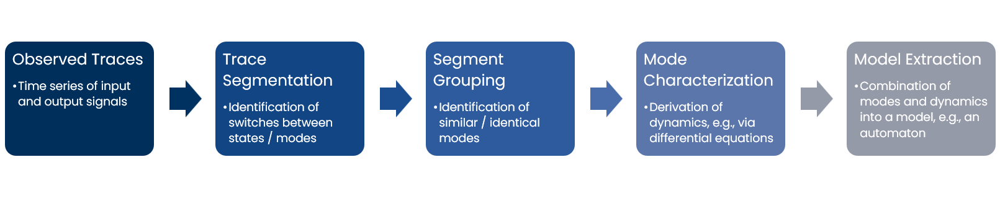

# SymbolicRegression4HA

This project implements the first steps for using symbolic regression in hybrid system identification.

The general flow of hybrid system identification has the following five steps:

This projects is composed of two algorithms which implement the steps *Trace Segmentation* and both *Segment Grouping* and *Mode Characterization*.

## Project Structure

The project is structured as follows:
- the directory `src` contains the source code of the project separated into the core parts such as the symbolic regression algorithm and the hybrid system identification algorithms and the intermediate results, further there are stopping criteria for the algorithms, experiment scripts for the segmentation and grouping part and scripts for parameter studies with optuna for selected examples. Finally, the directory contains the main script for running the complete flow
- the directory `data` contains data sets for example systems stored with git lfs
- the directory `results` contains the results of the experiments for the examples
- the directory `config` contains the configuration files for the experiments
- the directory `sr-analysis` contains scripts for minor analyses
- the directory `tests` provides an (incomplete) set of unit tests for the project 

## Publication and Reference

The project is part of the publication "Dynamics-Based Identification of Hybrid Systems using Symbolic Regression":

```
@inproceedings{PSSTF2024,
  author          = {Swantje Plambeck and Maximilian Schmidt and Audine Subias and Louise Travé-Massuyès and Goerschwin Fey},
  booktitle       = {Software Engineering and Advanced Applications (SEAA)},
  title           = {Dynamics-Based Identification of Hybrid Systems using Symbolic Regression},
  year            = {2024 (in press)},
    url           = {https://www.tuhh.de/t3resources/es/data/publications/inPress/Learning_Hybrid_Systems_with_Symbolic_Regression-10.pdf}
}
```

## Getting Started